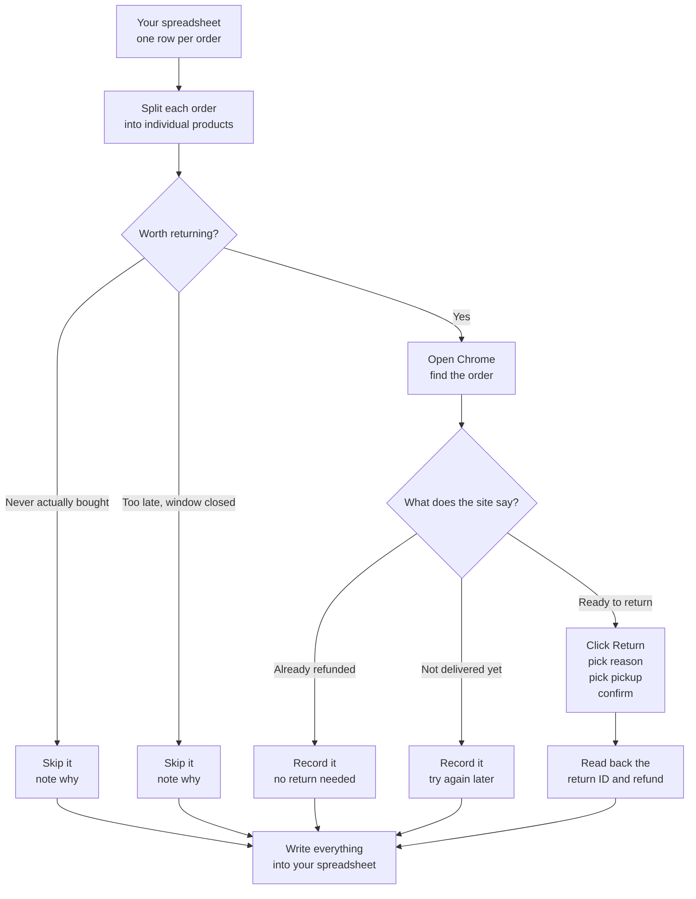

# Faym — Automated Multi-Item Returns Agent

**Returning things on Flipkart and Amazon is a chore. Somebody has to open the
site, find the order, find the right product, click Return, pick a reason,
confirm, then write the return ID into a spreadsheet. Times fifty. This does
that part.**

You keep a spreadsheet of things that need returning. The agent reads it, opens
a real Chrome window, and works through the list the way a person would —
clicking the same buttons, at roughly human speed. When it's done, the results
are back in your spreadsheet: what got returned, the return ID, the refund
amount, and what needs a human to look at.

🎥 **Demo Video:** https://drive.google.com/file/d/1jooptDaDxU_g2wjFBqBidFrxJ5BMacO0/view?usp=sharing
> **New here?** Everything down to *"Where to go next"* is written for anyone.
> The engineering detail starts after that.

---

## How it works



The important part is the middle: **it checks before it acts.** If the site says
an item was already refunded, or hasn't arrived yet, it records that and moves
on instead of blindly clicking Return.

Results are written **as each order finishes**, not banked up to the end — so a
crash or a Ctrl-C can never leave a return filed on the platform with no record
of it in your file.

> **There is also a mode that skips the spreadsheet** and works out what to
> return by reading your orders page directly. That's an extension, not the main
> path — see [Discovering orders without a spreadsheet](#discovering-orders-without-a-spreadsheet).

---

## One order can hold several products

This is the thing that makes the job fiddly, and it's worth seeing concretely.
It bites both ways in: an order card on the site lists several products, and a
spreadsheet row crams several product links into one cell.

In the sample spreadsheet, order `OD337974610559997100` is a **single row**. But
that one row has **five product links** crammed into one cell, and one of them is
marked `NA` — meaning it was looked at but never actually bought.

So the agent splits that one row into five, and treats each product separately:

| Product | Was it bought? | What happened |
|---|---|---|
| dolsia regular women blue jeans | Yes | Return attempted |
| tokyo talkies loose fit women blue jeans | **No — marked `NA`** | **Skipped, flagged for a human** |
| pinklit wide leg women blue jeans | Yes | Return attempted |
| vasan women a line maroon midi dress | Yes | Return attempted |
| shivanshcloset women fit flare maxi dress | Yes | Return attempted |

If the agent had missed that `NA`, it would have tried to return something the
customer never bought. Across the whole sheet, **7 rows become 16 products, 14 of
which were really ordered.**

And critically: one product failing never stops the others. Four returns still go
through even though the fifth was skipped.

---

## What you get back

Your original file is never touched. You get a **copy** with a new sheet in it,
one line per product. These rows are real output, copied from
[`data/`](data/) in this repo:

| Product | Return ID | Return status | Detail | Task status |
|---|---|---|---|---|
| gulab thar | N/A | Out of window | Out of window | Done |
| tokyo talkies loose fit women blue jeans | N/A | Failed | Not ordered (NA) | Needs human review |
| dolsia regular women blue jeans | N/A | *(blank)* | Planned (not attempted) | Pending |

A successfully filed return would read `Placed` with the platform's own return ID
and refund amount in those columns. There is no such row in this repo yet,
because no return has been placed against a live site — see
[Known limits](#known-limits).

- **Return status** — the short answer: *Placed*, *Failed*, or *Out of window*.
- **Detail** — the fuller reason, because "Failed" alone doesn't tell you whether
  the item was never bought, hasn't arrived, or needs a support chat.
- **Task status** — whether it's finished, or whether somebody needs to look.

An order is only marked **Done** once every product on it has a final answer.
Anything uncertain gets flagged rather than quietly dropped.

---

## Is it safe to run?

Three things worth knowing before anyone runs this:

**It rehearses by default.** Run it normally and it walks through the entire
return process in a real browser — finds the item, picks the reason, fills the
form — and then *stops right before the final Confirm button*. Nothing is
submitted. Actually filing returns takes a deliberate extra flag **and** typing
the words `place returns` to confirm. You cannot do it by accident.

That's enforced twice over. Stopping before the confirm relies on the agent
knowing which button *is* the confirm — so no mid-flow step is allowed to click
a control labelled like the final submit, whatever selector found it. A loose
selector on the pickup step can't reach past the guard and file a return.

**The sample data can never file a real return.** `--sample` and `--live` are
refused together: those orders belong to somebody else.

**Nobody hands it a password.** Logging in needs a one-time code sent to the
account holder's phone. The agent types the phone number and asks the site to
send the code, then waits for you to read it out. It never sees or stores a
password.

Before it submits anything, it tells you how many line items are about to have
returns filed and waits for you to type the confirmation. `--limit 1` narrows
the first real run to a single item.

---

## Where to go next

- Want to run it? → [Quick start](#quick-start)
- Want to know how it decides what to return? → [Where the work list comes from](#where-the-work-list-comes-from)
- Want to know what the statuses mean in detail? → [Statuses](#statuses)
- Worried about getting the account blocked? → [Not getting flagged as a bot](#not-getting-flagged-as-a-bot)
- **Before anyone runs this for real** → [Read this before the first live run](#read-this-before-the-first-live-run)

---

# Technical reference

Everything below assumes you're comfortable on a command line.

---

## Quick start

```bash
pip install -r requirements.txt && python3 -m playwright install chromium
```

### Sample run

`--sample` runs the agent against the bundled sample spreadsheet
(`data/Faym Status Test Orders.xlsx`) with no path to type. It drives a real
browser through the return flows, stopping before every final confirm:

```bash
PYTHONPATH=src python3 -m faym_returns.cli --sample --limit 1
```

Two things happen automatically, because otherwise the sample demonstrates
nothing:

- **It backdates to 2026-07-06.** Every row in the sample sheet is long past its
  return window at today's date, so without this the agent would correctly
  refuse all 14 items and never open a page. Override with `--today`.
- **`--live` is refused.** Those are somebody else's orders.

Results go to `data/sample-run-results.xlsx`, which is untracked — the committed
outputs are never overwritten by a sample run.

Same thing without a browser, and a look at what the parser made of the sheet:

```bash
PYTHONPATH=src python3 -m faym_returns.cli --sample --offline
```

```bash
PYTHONPATH=src python3 -m faym_returns.cli --sample --inspect
```

### Your own spreadsheet

The main path. Results go to `<name>-results.xlsx` **beside your file**; the
source is never modified. Plan it offline first, no browser:

```bash
PYTHONPATH=src python3 -m faym_returns.cli ~/orders.xlsx --offline
```

Then a dry run in a real browser — walks every return flow but never clicks the
final confirm. **This is the default**; there is no way to submit by accident:

```bash
PYTHONPATH=src python3 -m faym_returns.cli ~/orders.xlsx --phone 9876543210 --limit 1
```

Place the returns for real. Needs the flag *and* a typed confirmation, which
tells you the exact line-item count first:

```bash
PYTHONPATH=src python3 -m faym_returns.cli ~/orders.xlsx --phone 9876543210 --live --limit 1
```

### Discovering orders without a spreadsheet

`--discover` skips the sheet and builds the work list by signing in and walking
*My Orders*. Use it when a sheet has gone stale, or when there isn't one. It is
an **extension beyond the specified workflow**, which is spreadsheet-driven, so
it is never reached by default:

```bash
PYTHONPATH=src python3 -m faym_returns.cli --discover --platform Flipkart --phone 9876543210 --limit 1
```

`--platform` is required, because with no sheet nothing else says which site to
sign into. Pass it twice for both. The walk covers **30 days** of order history
and at most **25 orders per site** (`--discover-days`, `--discover-max-orders`);
`--limit` caps line items across the whole run.

Results are written to `returns-<timestamp>.xlsx` in the directory you ran from,
created fresh — there is no input file to copy. It uses the *input* format's own
columns, so what a discovery run produces can be fed straight back in as the
input to a later spreadsheet run.

Run the tests:

```bash
python3 -m pytest -q
```

---

## Read this before the first live run

**1. The selectors need one supervised pass against the live sites.**
Every selector lives in [`src/faym_returns/selectors/`](src/faym_returns/selectors/)
as an *ordered candidate list* — accessibility role and visible text first, CSS
last. They were authored from the documented flow but have **not** been confirmed
against the live DOM, because doing so requires signing into the real account.
Run `--limit 1` in dry-run mode, watch the browser, and fix whatever misses in the
YAML. That is a config edit, not a code change.

It applies double to the `discovery:` block, used only under `--discover`. If it
matches nothing the run reports *"No order cards matched"* and stops — an empty
result, not a wrong one. Watch the first dry run and check the count it logs
against what you can see on the page yourself.

**2. Every order in the sample dataset is already out of window.**
The delivery dates are late June / early July 2026 with 7–10 day windows; today is
past all of them. The agent correctly refuses all 14 items. `--sample` backdates
to `2026-07-06` for you, exercising the pipeline as it would have behaved when
the orders were live. None of this touches a real run: your own workbook is
judged against the real date unless you pass `--today` yourself.

**3. Login: the agent drives the form, you supply the code.**
Give it the mobile number with `--phone` and it fills the login form and presses
*Request OTP* itself. The code cannot be automated — it is delivered out of band
to the account holder — so the agent prompts you for it at the terminal, then
types and submits it.

Omit the number and it falls back to letting you sign in entirely by hand; it also
falls back automatically if the login form can't be located, so a changed login
page never blocks a run.

**Sign in once, ahead of everything else:**

```bash
PYTHONPATH=src python3 -m faym_returns.cli --login --platform Flipkart --phone 9205359199
```

That signs in, confirms it worked, and exits — no returns attempted, no file
written. The profile persists, so every later run reuses the session and you are
not asked for another code. Re-run it any time to check the session is still
alive; it will say *"already signed in (restored from the profile)"* and cost
nothing.

Two things end a session early, and both are now handled loudly rather than
quietly: **the profile can only be open once**, so a run refuses to start if a
Chrome window is already using it rather than silently opening a second,
signed-out browser; and if installed Chrome can't be launched at all, the
bundled-Chromium fallback gets its **own** profile directory, because pointing
two different browser builds at one `user_data_dir` corrupts it and the thing
you lose is the saved login.

Codes are held in memory only for the moment between entry and submission. They
are never logged, written to the workbook, or persisted.

---

## Where the work list comes from

The spreadsheet is the input. `--discover` is a second way in, off by default.
Both produce `LineItem`s, and from that point the code is identical: the same
eligibility pre-check, the same platform adapters, the same write-back.

| | Spreadsheet (default) | `--discover` |
|---|---|---|
| Work list from | a `Product Link` cell | the account's orders page |
| Order ids | the `Order Id` column | read off the page |
| Delivery date | the `Delivery date` cell | read off the card, when shown |
| Return window | the `Return Window` cell | page copy when stated, else deferred |
| Output file | a copy of your input | created fresh |

### Discovering from the account

The walk is bounded on purpose — an order history can be years deep and a run
that reads all of it is a crawl, not a returns pass. It stops at
`--discover-days` (30), `--discover-max-orders` (25) per site, and three pages of
history.

Cards are filtered on their visible copy before anything is opened: kept when the
platform shows a return is plausible, dropped when it already reads *refunded*,
*cancelled*, *return requested* or *window closed*. **That filter is a cheap
pre-pass, not the verdict.** Every card that survives is opened and each product
on it classified properly, which is what actually decides the outcome. The filter
can only cost you a return it declined to look at — it can never cause one to be
filed.

The `Return window` the spec asks for is read off the card when the platform
states it (`"10 days return policy"`), and feeds the same eligibility pre-check
the spreadsheet's own column feeds. When the page doesn't say, the item carries a
note recording that and the platform's check on the order page is left to decide
— the sheet path behaves identically for a row with an empty window cell.

Discovered orders are written into the results workbook *before* any return is
attempted. That is what gives each line item a `Source Row`, so the roll-up, the
write-back and resuming all work exactly as they do for a spreadsheet run.

### Reading a spreadsheet

The source sheet is **order-level** — one row per order, with every product URL
crammed into a single `Product Link` cell — but the spec requires an outcome per
SKU. So the agent explodes each order row into line items. On the sample dataset,
**7 order rows become 16 line items, 14 of them actually ordered.**

Two conventions in that cell carry real meaning:

| Convention | Meaning | Why it matters |
|---|---|---|
| A bare `NA` after a URL | That item was **not** ordered | Rows 6 and 8 each hold five links but declare `No of Product = 4`; in both, the extra link is the one trailed by `NA`. Reading it as ordered would file a return for something never bought. |
| The `pid=` query param | The line-item identity | The sheet has no SKU column. The pid is what distinguishes four near-identical shoulder bags on one order. |

The parser also survives what is actually in those cells: WhatsApp export prefixes
(`[8:23 pm, 26/06/2026] Arti Faym C: Take a look at this…`), a Meesho promo blurb,
a stray `size xxl` note, dirty windows (`10 Days`, `7 Days `, `10 Day`), and
delivery dates typed as ranges (`5-6 July`). Extracted counts are cross-checked
against `No of Product` and a mismatch is flagged for a human rather than guessed.

The order-level `Amount` is **never** divided to estimate a per-item refund.
Refund amounts are only ever recorded as the platform reports them.

---

## Write-back

Results land in a **copy** of your workbook, written beside the original as
`<name>-results.xlsx`; the input file is never modified. A `--discover` run has
nothing to copy, so it **creates** `returns-<timestamp>.xlsx` in the working
directory instead. `--working-copy` puts either somewhere else.

Both files have the same two sheets:

- **`Line Items`** — one row per SKU: Return ID, Return Status, Refund Amount,
  Task Status, Timestamp, Log, and a `Source Row` back-pointer. This is the
  record of truth.
- **`Sheet1`** — one row per order with a rolled-up summary in the
  `Refund ID` / `Return Status` / `Refund Amount` / `Timestamp` / `Log` columns,
  so the file stays readable at a glance. For a spreadsheet run this is your
  original sheet, annotated. Under `--discover` it is written from what was
  found, using the *input* format's columns — so it can be fed back in.

**Written per order, not banked to the end.** Each record's outcomes are saved
as soon as that order finishes, and again on the way out of the run — including
under a second Ctrl-C, which is a `KeyboardInterrupt` and escapes ordinary
exception handling. A return that has been filed on the platform but not
recorded anywhere is the expensive failure: the money has moved and the only
trace is on the site. The window where that can be true is one order wide.

Re-running updates rows in place, keyed on `(Order ID, SKU)`. It never appends
duplicates.

### Statuses

The spec fixes `Return status` to **Placed / Failed / Out of window**, which can't
express everything a platform actually reports. So that column holds only those
three values, and a `Detail` column carries the precise state. Nothing is lost and
the column stays conformant.

| Detail | Return status | Task status |
|---|---|---|
| `Placed` | `Placed` | Done |
| `Already Cancelled & Refunded` | `Placed` | Done |
| `Out of window` | `Out of window` | Done |
| `Not yet delivered` | `Failed` | Done |
| `Support Needed` | `Failed` | **Needs human review** |
| `Item not found on order` | `Failed` | **Needs human review** |
| `Not returnable` | `Failed` | **Needs human review** |
| `Not ordered (NA)` | `Failed` | **Needs human review** |
| `Failed` | `Failed` | **Needs human review** |
| `Planned (not attempted)` | *(blank)* | Pending |

Two mappings are judgement calls worth stating:

- **`Already Cancelled & Refunded` → `Placed`.** A return and refund do exist for
  that line item; the agent simply didn't have to create them. `Failed` would be
  plainly wrong.
- **`Planned (not attempted)` → blank.** Neither a dry run nor an offline plan
  submits anything, so claiming `Failed` would assert a failure that never
  happened. Blank, paired with a Task status of `Pending`, says exactly what is
  true.

**A dry run never records `Placed`.** It walks the whole flow and stops at the
confirm, so the item is `Planned` — which is also *non-final*, so the next
`--live` run picks it straight back up. Recording `Placed` would be false in the
spec's own column, and worse, would make `--live` skip every item the rehearsal
had just walked, placing nothing at all.

Resume decisions read `Detail`, not `Return status` — `Support Needed` and
`Failed` both collapse to `Failed`, but only the latter should be re-attempted.

`Failed` and `Planned` are the only non-final states, so only those requeue on the
next run. Anything unrecognised in the column — including statuses an operator
typed by hand — is treated as settled, because filing a duplicate return is the
more expensive mistake.

---

## Partial success

Line items are processed independently, which is the whole point:

- An item past its window is logged and skipped; the rest of the order proceeds.
- An order row is marked `Done` only once **every** line item holds a final state.
- If any item needs a human, the order row is flagged for review — never silently
  dropped.
- Items marked `NA` are excluded from the roll-up entirely, so a never-ordered
  link cannot drag an otherwise-complete order into review.

On the test dataset, order `OD337974610559997100` demonstrates this: five links,
one `NA`, four returns attempted.

---

## Batch vs sequential flows

The agent detects which model a platform uses and follows the right path.
`process_order()` returns an outcome **per SKU** either way, so write-back stays
line-item oriented regardless.

Each record gets its own browser tab, per the spec workflow; the tab is closed
when the record is done so a long run doesn't accumulate one tab per order. The
browser context is shared, so a new tab never means signing in again.

- **Flipkart — sequential.** No multi-item wizard exists; each SKU has its own
  Return control and its own window, so the micro-flow repeats per item.
- **Amazon — batch, with sequential fallback.** The "Return or replace items"
  wizard lists every item with a checkbox. When two or more are present the
  adapter selects them and makes one pass; otherwise it falls back to per-item.
  A batch return ID is shared across the items it covers, and the log says so.

---

## Not getting flagged as a bot

Detection keys on inhuman *timing*, *pointer paths* and *throughput* far more than
on fingerprint trivia, so that is where the effort goes.

**Session and fingerprint**
- Real installed Chrome (`channel="chrome"`), not bundled Chromium.
- A persistent `user_data_dir`, so cookies and device trust survive between runs.
  Repeatedly logging in from a clean fingerprint is itself a strong bot signal.
- Headless is **refused outright** — it is trivially detectable.
- `en-IN` locale, `Asia/Kolkata` timezone and Gurgaon geolocation, so the
  fingerprint agrees with the account's real-world context.
- Automation flags suppressed via `--disable-blink-features=AutomationControlled`
  and `ignore_default_args=["--enable-automation"]`.

**Deliberately minimal patching.** Verified on a real navigation, this setup
already reports `navigator.webdriver === false` (the genuine Chrome value), a real
`PluginArray` with the actual PDF Viewer entries, real WebGL vendor passthrough
and a real core count. So the init script patches almost nothing. Forcing
`navigator.webdriver` to `undefined` — as most stealth snippets do — is *itself* a
tell, because no real browser reports undefined; and faking `navigator.languages`
desynchronises it from the `Accept-Language` header Playwright derives from the
locale. The only correction applied is normalising `webdriver` to `false` on the
bundled-Chromium fallback path.

**Behaviour**
- Pointer moves along an eased Bézier arc in many small steps, decelerating into
  the target, and clicks land off-centre with a realistic press duration.
- Typing is per-character with variable delay and occasional longer pauses.
- Scrolling happens in uneven bursts, not one jump.
- Reading pauses before acting; aimless movement between items.

**Throughput**
- 12–38 s between line items, 25–70 s between orders, and a 2–5 minute break
  every 6 items.
- Hard cap of 25 line items per session; the rest stay Pending for a later run.
- Quiet hours (01:00–07:00 by default) block a run outright — nobody files
  returns at 04:00.
- Never parallelised against one account.

**Interrupting a run**
Ctrl-C sets a stop flag rather than unwinding immediately, so the run finishes
the line item in flight and stops at the next pause - never between clicking
Confirm and reading back the return ID. Whatever was gathered is still written
to Excel. A second Ctrl-C stops at once.

**On challenge**
A captcha or block page **aborts the session** rather than retrying. Hammering a
challenge is what turns a soft flag into a hard ban. Unfinished items stay
Pending, and a screenshot is saved.

Pacing is seeded (`--seed`) so a failure can be reproduced. `--fast` compresses
the delays for debugging and should never point at a live site.

---

## Useful flags

| Flag | Effect |
|---|---|
| `--live` | Actually submit. Off by default; also needs a typed confirmation. |
| `--login` | Sign in to `--platform`(s) and exit. Do this once before a session; later runs reuse it. |
| `--discover` | Build the work list from the account's orders page instead of a sheet. Takes no workbook; needs `--platform`. |
| `--sample` | Run against the bundled sample sheet, no path needed. Backdates to 2026-07-06; cannot be combined with `--live`. |
| `--offline` | Plan only; no browser. Needs a sheet — there is nothing to plan offline without one. |
| `--inspect` | Print parsed line items and exit. Writes nothing. Sheet runs only. |
| `--limit N` | Cap line items this run, across every site. Use `--limit 1` for the first live run. |
| `--order ID` | Restrict to one order (repeatable). |
| `--platform` | Which site(s) to drive (repeatable). A filter for a sheet run; **required** with `--discover`. |
| `--discover-days N` | How far back `--discover` reads order history (default 30). |
| `--discover-max-orders N` | Ceiling on orders `--discover` takes from each site (default 25). |
| `--today DATE` | Override today's date for the window check. |
| `--no-resume` | Re-attempt items that already hold a final status. |
| `--phone N` | Mobile number for OTP sign-in. The agent fills the form and requests the code, then asks you for it. |
| `--seed N` | Seed the timing RNG for reproducible runs. |
| `--allow-quiet-hours` | Permit a run inside quiet hours. |
| `--grace-days N` | Slack before declaring an item out of window (default 1). |

---

## Layout

```
src/faym_returns/
  cli.py            entry point; picks the input path, dry-run by default
  orchestrator.py   run loop, triage, partial-success handling
  normalize.py      messy-cell parsing, order row -> line items
  eligibility.py    return-window pre-filter
  workbook.py       Excel read, per-line-item write-back, from-scratch output
  browser.py        persistent Chrome session, fingerprint, challenge detection
  humanize.py       timing, pointer paths, typing rhythm
  progress.py       cooperative stop signal (Ctrl-C aborts at a safe pause)
  otp.py            one-time-code provider for the OTP sign-in
  platforms/
    base.py         adapter contract, selector resolution, order discovery
    flipkart.py     sequential per-item flow
    amazon.py       batch detection + sequential fallback
  selectors/*.yaml  all selectors, as ordered candidate lists
tests/              179 tests; the browser is stubbed, the data is real
```

## What's in `data/`

Everything needed to run and verify this, committed so a fresh clone works with
no setup:

| File | What it is |
|---|---|
| `Faym Status Test Orders.xlsx` | The supplied input, byte-for-byte unmodified. Never written to. |
| `Faym Status Test Orders-results.xlsx` | Output at today's date: 14 out of window, 2 not ordered |
| `demo-backdated-2026-07-06.xlsx` | Output backdated to when the orders were live: 13 eligible, 1 expired, 2 not ordered |

The test suite reads the committed input, so `pytest` passes on a clean clone.

`--sample` writes to `sample-run-results.xlsx` here, which is untracked — it is
regenerable at any time and never overwrites the two committed outputs above.
Runs against your own workbook write nowhere near this directory.

---

## Other spreadsheets

Nothing about the spreadsheet path is tied to the sample file. Verified working
on data it had never seen:
Amazon orders with ASIN links, Amazon and Flipkart mixed in one sheet, dates as
plain strings or `20/07/2026`, `10Days` with no space, a window given as a bare
number, rows where every link is `NA`, rows with no usable link, unknown
platforms, and rows already marked `Done` (correctly skipped).

**Column names are the contract**, but matching is loose: case, spaces and
punctuation are ignored, and common variants are recognised — `OrderID`,
`order_id`, `Product URL`, `Site`, `Qty`, `Delivered On` all resolve. Four
columns are required: `Order Id`, `Product Link`, `Status`, `Platform`.

If a required column genuinely cannot be found, the agent **refuses to run and
names what is missing** rather than reporting nothing to do — a silent empty
result is indistinguishable from a clean one. Same for a wrong sheet name: it
lists the tabs that do exist.

---

## Known limits

- **Selectors are unverified against the live DOM.** See point 1 above. The
  `discovery:` blocks are the newest of them and the least exercised.
- **Discovery has never run against a real order history.** The card parsing is
  tested against stubbed pages, so its logic is covered, but which selectors
  match and what a real card's copy says are open questions until one supervised
  run answers them.
- **Under `--discover`, a card showing no date is kept, not skipped.** Unknown is
  not the same as expired, so the `--discover-days` cutoff cannot see it and the
  item goes through to the platform's own check. That errs toward opening one
  order too many rather than missing a returnable item.
- **The eligibility check is a pre-filter, not the authority.** It only rejects
  items that are clearly expired, and defers to the platform whenever a date is
  approximate or missing.
- **Amazon is untested end-to-end** — the dataset is entirely Flipkart. The batch
  path is built to the documented flow and needs one supervised run.
- **Refund routing is left at the platform default.** The agent will not choose a
  bank account; that is a money decision for a human. Likewise it confirms the
  pickup address already on the order rather than changing where a courier goes.
